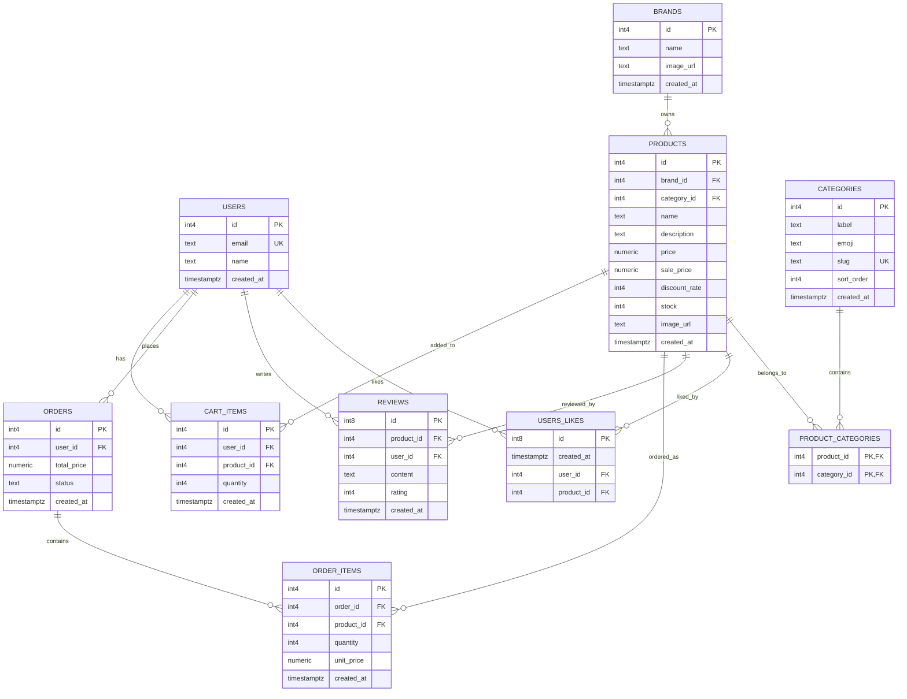

# 🛍️ Fitory - Next.js 기반 의류 쇼핑몰 플랫폼

<br>


> **Fitory**는 Supabase와 Next.js 16을 기반으로 구축한 의류 쇼핑 플랫폼입니다.  
> 서버 상태와 클라이언트 상태를 분리하여 관리하고, 역할 기반으로 기능을 분담하여 협업 효율성을 고려한 구조로 설계했습니다.

<br/>

## 👨‍💻 Team & Contribution
각 구성원이 핵심 도메인을 하나씩 전담하여 구현했습니다.
<table>
  <tbody>
    <tr>
      <td align="center"><a href="https://github.com/yyubin"><br /><sub><b>박유빈</b></sub></a><br /></td>
      <td align="center"><a href="https://github.com/dh0250"><br /><sub><b>한다현</b></sub></a><br /></td>
     <td align="center"><a href="https://github.com/chan-nni"><br /><sub><b>강찬미</b></sub></a><br /></td>
    </tr>
  </tbody>
</table>

* **박유빈 (공통 상태 관리):** Zustand 기반 전역 상태 설계 (로그인 세션 및 모달 시스템)
* **한다현 (장바구니 & 상품):** 장바구니 상태(`useCartStore`) 및 상품 렌더링 로직 구현
* **강찬미 (리뷰 시스템):** 리뷰 기능 구현 및 React Query 기반 서버 상태 관리

<br/>

## 🛠️ Tech Stack
* **Framework:** Next.js 16.2.4 (App Router), React 19
* **Styling:** Tailwind CSS v4
* **Backend & DB:** Supabase (PostgreSQL, Auth)
* **State Management:**  
  * Client State: `zustand` (persist middleware)  
  * Server State: `@tanstack/react-query`

<br/>

## 📋 핵심 기능 및 도메인 명세 (Core Features & Domain)

### 🛍️ 1. 상품 (Product)
* **핵심 기능:** 상품 목록 조회(카테고리, 브랜드 필터링), 상품 상세 조회, 실시간 재고(`stock`) 관리, 관리자 상품 등록/수정/삭제
> **💡 주요 특징 및 구조**
> - **할인 구조 분리:** `price`(원가), `sale_price`(할인가), `discount_rate`(할인율)
> - **매핑 관계:** 카테고리 다대다(`product_categories`) 매핑 및 브랜드(`brand_id`) 연결

### 🏷️ 2. 카테고리 및 브랜드 (Category & Brand)
* **핵심 기능:** 카테고리 및 브랜드 목록 조회, 상품과 브랜드 연결 노출
> **💡 주요 특징 및 구조**
> - **정렬 제어:** `sort_order` 컬럼을 활용한 카테고리 노출 순서 제어

### 🛒 3. 장바구니 (Cart)
* **핵심 기능:** 장바구니 상품 추가, 담긴 수량 변경, 목록 조회, 특정 상품 삭제
> **💡 주요 특징 및 구조**
> - `user_id` + `product_id` 결합 기반으로 사용자와 상품을 식별하여 장바구니 데이터 구조화

### 📦 4. 주문 (Order)
* **핵심 기능:** 주문 생성(장바구니 데이터를 실제 주문으로 변환), 사용자 기준 주문 목록 조회
> **💡 주요 특징 및 구조**
> - **데이터 분리:** `orders` (전체 주문 집계) / `order_items` (개별 주문 상품 내역)
> - **스냅샷 보존:** 주문 시점의 가격 변동에 대비하여 `order_items`에 결제 가격(`unit_price`)을 스냅샷 형태로 독립 저장

### ⭐ 5. 리뷰 (Review)
* **핵심 기능:** 상품에 대한 사용자 리뷰 작성
> **💡 주요 특징 및 구조**
> - 1~5점 평점(`rating`) 시스템 부여
> - 사용자(`user_id`)와 상품(`product_id`) 식별자를 명확히 연결

### ❤️ 6. 좋아요 (Like)
* **핵심 기능:** 상품 찜하기(좋아요) 및 취소, 내가 좋아요 누른 관심 상품 목록 조회
> **💡 주요 특징 및 구조**
> - `users_likes` 단순 매핑 테이블 활용
> - 빠른 UI 피드백을 위한 Soft Toggle 구조 설계

### 👤 7. 사용자 (User)
* **핵심 기능:** 사용자 기본 정보 조회
> **💡 주요 특징 및 구조**
> - 현재 인증/권한 로직은 배제되어 있으며, 향후 확장(Auth 도입)을 고려하여 유연하게 설계됨

<br/>

## 💡 Core Architecture & Key Logic (핵심 설계)

세 가지 주요 영역으로 구조를 분리하여 상태 관리와 비즈니스 로직을 명확히 구분했습니다.

### 1. 전역 상태와 세션 관리 (by 박유빈)
* **내용:** `useUiStore`를 통해 전역에서 모달 상태를 제어하고, `useUserStore`에 `persist` 미들웨어를 적용하여 로그인 세션을 로컬 스토리지와 동기화했습니다.
* **효과:** 전역 UI 상태 관리 로직을 단순화하고, 사용자 세션을 유지할 수 있도록 구성했습니다.
* **핵심 로직:**
    ```JavaScript
    export const useUserStore = create(persist((set) => ({
        user: null,
        _hasHydrated: false,

        logout: () => set({ user: null }),
        setUser: (user) => set({ user }),
        setHasHydrated: (v) => set({ _hasHydrated: v }),
    }), {
        name: "user",
        onRehydrateStorage: () => (state) => {
            state.setHasHydrated(true)
        },
    }));
    ```

### 2. 장바구니 제어 및 코어 로직 (by 한다현)
* **내용:** `useCartStore`를 통해 장바구니 상태를 전역으로 관리하고, 상품 추가 시 기존 데이터를 탐색하여 수량을 갱신하거나 신규 데이터를 추가하는 로직을 구현했습니다.
* **효과:** 장바구니 상태를 일관되게 유지하며, `persist` 미들웨어를 통해 페이지 이동 및 새로고침 이후에도 상태가 유지되도록 했습니다.
* **핵심 로직:**
    ```JavaScript
    export const useCartStore = create(persist((set) => ({
        cart: [],
    
        addToCart: (product, quantity) => set((state) => {
            const exists = state.cart.find(
                item => item.id === product.id
            );
    
            if(exists) {
                return {
                    cart: state.cart.map(item => 
                        item.id === product.id 
                        ? {...item, quantity: item.quantity + quantity}
                        : item
                    )
                }
            }
            return {
                cart: [...state.cart, { ...product, quantity }]
            }
        }),
    
        removeFromCart: (id) => 
            set((state) => ({
    
                cart: state.cart.filter((item) => item.id !== id),
            })),
        
        updateQuantity: (id, quantity) =>
            set((state) => ({
                cart: state.cart.map(item =>
                    item.id === id? { ...item, quantity } : item
                ),
            })),
    
        clearCart: () => set({ cart: []})
    }), { name: "cart" }));
    ```

### 3. 실시간 리뷰 동기화 (by 강찬미)
* **내용:** React Query의 `useMutation`과 `invalidateQueries`를 활용하여 리뷰 데이터를 관리했습니다.
* **효과:** 리뷰 생성 및 수정 이후, 별도의 새로고침 없이 최신 데이터가 즉시 반영되도록 구현했습니다.
* **핵심 로직:**
    ```JavaScript
    const mutation = useMutation({
        mutationFn: (newReview) => createReview(newReview),
        onSuccess: () => {
            queryClient.invalidateQueries(['reviews', productId])
            setContent('')
            setRating(5)
            alert('리뷰가 등록되었습니다.')
        },
    })
    ```


<br/>

## 🗺️ ER Diagram


## 📂 Folder Structure
관심사 분리 원칙에 따라 파일 구조를 구성했습니다.

```text
FITORY/
├── app/                  # Next.js App 라우터 및 페이지
│   ├── products/         # 상품 상세 및 리뷰 페이지
│   └── components/       # 공통 UI 컴포넌트
├── lib/
│   ├── data/             # Supabase API 함수
│   └── supabase/         # Supabase 설정
├── store/                # Zustand 전역 상태
│   ├── useCartStore.js   # 장바구니 상태 및 로직
│   ├── useUiStore.js     # UI 상태 관리
│   └── useUserStore.js   # 사용자 세션 관리
└── supabase/
    └── migrations/       # DB 스키마 및 초기 데이터
````

<br/>

## 🔥 Troubleshooting (트러블슈팅)

### 1. React Hook 실행 순서 위반 (Rules of Hooks) 에러 해결

* **문제:** 조건부 `return`이 먼저 실행되면서 Hook 호출 순서가 변경되어 에러가 발생했습니다.
* **해결:** 모든 Hook을 컴포넌트 최상단에서 호출하도록 구조를 수정하고, 조건부 렌더링을 이후로 이동시켜 실행 순서를 고정했습니다.

### 2. 로그아웃 시 장바구니 데이터 잔존 문제 해결

* **문제:** 로그아웃 이후에도 localStorage에 장바구니(cart) 데이터가 남아 있어, 다른 사용자 또는 비로그인 상태에서 이전 사용자의 장바구니가 노출되는 문제가 발생했습니다.
* 
  

* **원인:** 기존 로그아웃 로직이 userStore의 세션만 초기화하고, cartStore 상태 초기화가 누락되어 `persist` 미들웨어에 의해 데이터가 유지되었습니다.
* **해결:** useLogout 커스텀 훅을 생성하여 로그아웃 로직을 통합했습니다.사용자 세션 종료와 동시에 장바구니를 초기화하도록 수정하여 데이터 동기화 문제를 해결했습니다.

  
  
* **useLogout Hook:**
  ```JavaScript
  export function useLogout() {
    const logout = useUserStore((state) => state.logout);
    const clearCart = useCartStore((state) => state.clearCart);
  
    return () => {
      clearCart();  // 남아있는 장바구니 데이터 초기화
      logout();     // 유저 세션 초기화
      // ... (이후 메인 페이지로 리다이렉트)
    };
  }
  ```

<br/>

## 🚀 Getting Started

```bash
# 1. 패키지 설치
npm install

# 2. 환경변수 설정 (.env.local)
NEXT_PUBLIC_SUPABASE_URL=your_supabase_url
NEXT_PUBLIC_SUPABASE_ANON_KEY=your_supabase_anon_key

# 3. 개발 서버 실행
npm run dev
```
